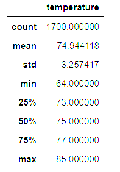

# Surfs_up
Analyzing weather data in jupyter notebook and making an app 

## Overview of analysis
'
The purpose of our analysis is to see temperature statistics for June and December to see if running a surf shop is sustainable year around. The way we get the temperature data is by running two seperate queries, one being for June and the other being December. Once we run our queries we store the temperatures in a list then convert them to a dataframe. Once our dataframe is created we are able to get our summary statistics by using the .describe() method. Here is what we found:
'
___

# Results

 ## For the Month of __June__ from 2010 to 2017, we had:
* Total count of 1,700 data points
* Mean of 74.9  F
* Min temperature of 64.0 F
* Max temperature of 85.0 F
* 75% Max temperature of 85.0 F

___
 
 ## For the month of __December__ from 2010 to 2016, we had:
- Total count of 1,517 data points
- Mean of 71.0  F
- Min temperature of 56 F
- Max temperature of 83.0 F
- 75% Max temperature of 74.0 F

  
 -- Standard deviation is 3.25 in June and 3.75 -- making a .5 difference in the two different seasons

___

# Summary 

From the queries required on the challenge, we can tell the temperature behavior for the months of June and July.  However, besides temperature, preciptiation is an important fact for surfers.  On the module we ran a precipitation query